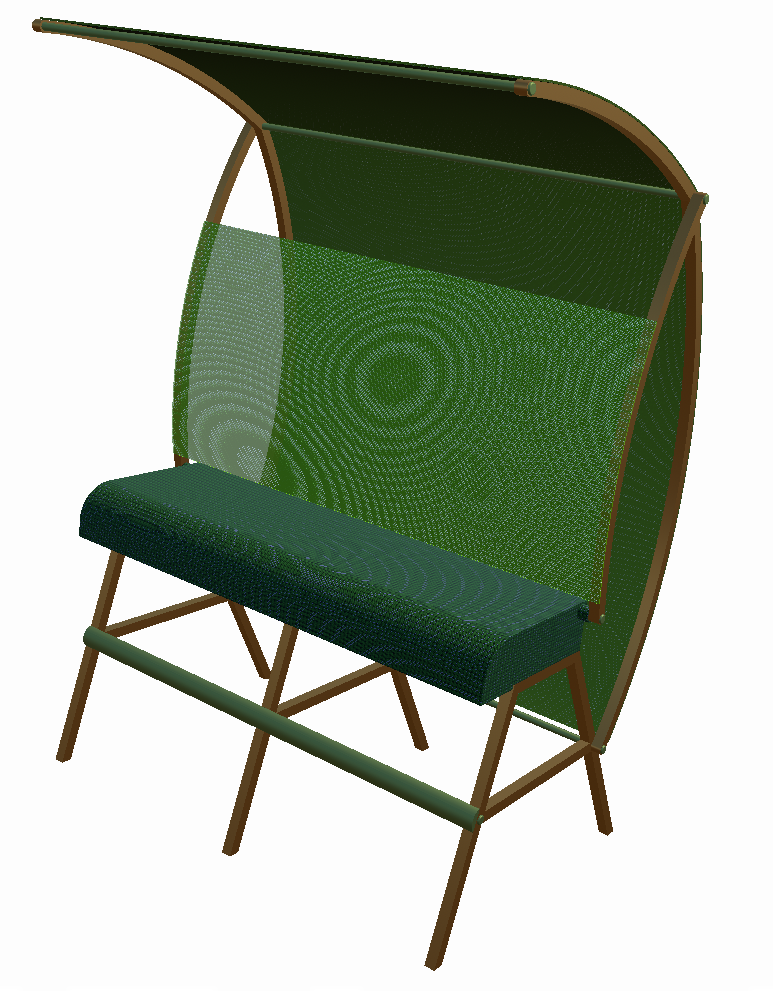
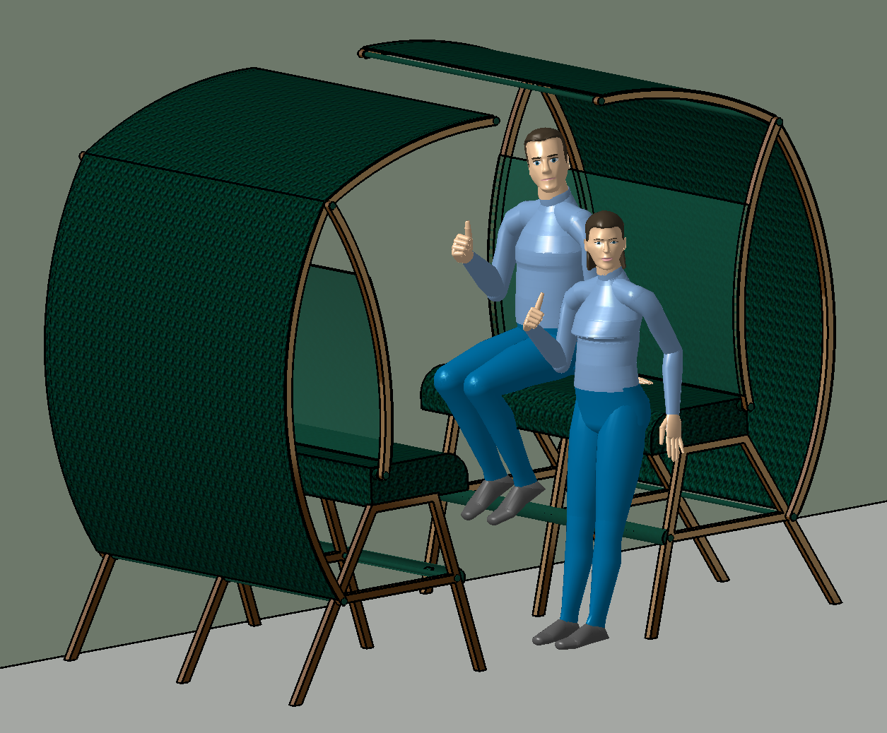
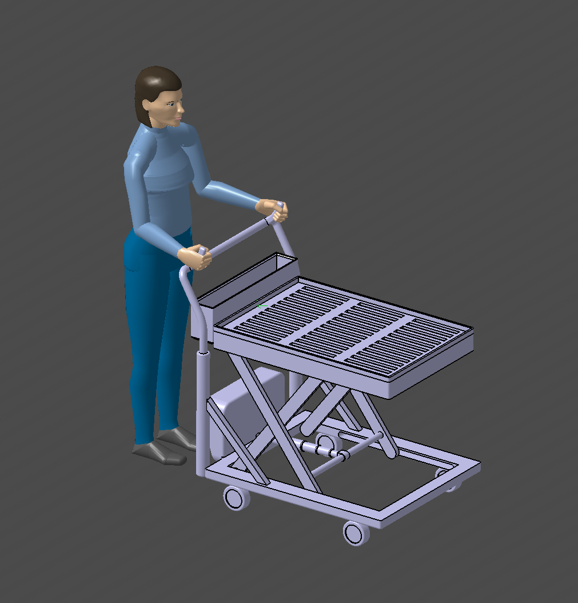

# Portfolio
## Computer Aided Design
I have experience in both parametric and surface modeling CAD software. In the last two years I have mainly used CATIA and Alias. I also have experience in Solidworks and Fusion 360.
### CATIA
Fiskelåda - CAD kurs

Frida - förbättra skolmiljön

Skotarkran - ett mekanikprojekt

Vagn för färgbutik - ett ergonomiprojekt

### Alias
Parfymflaska

  

Tåg

Dammsugare

### Jack

### Husbil

Elsystem

### Photoshop & Illustrator
Posters
  Bioplastik från nanocellulosa

  Kamera

  Sadelstolpe - Materialteknik

  

### Sketching
Bentley Municipal - a city car concept

### övriga 

    

### About me
text
### Download CV
file location
### Contact info
#### Email
edvin02.em@gmail.com
#### Phone number
+46-72-731-1846
#### Adress
431 31 Mölndal
Broslättsgatan 37b
