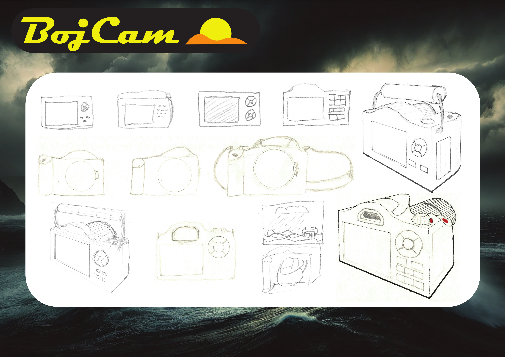
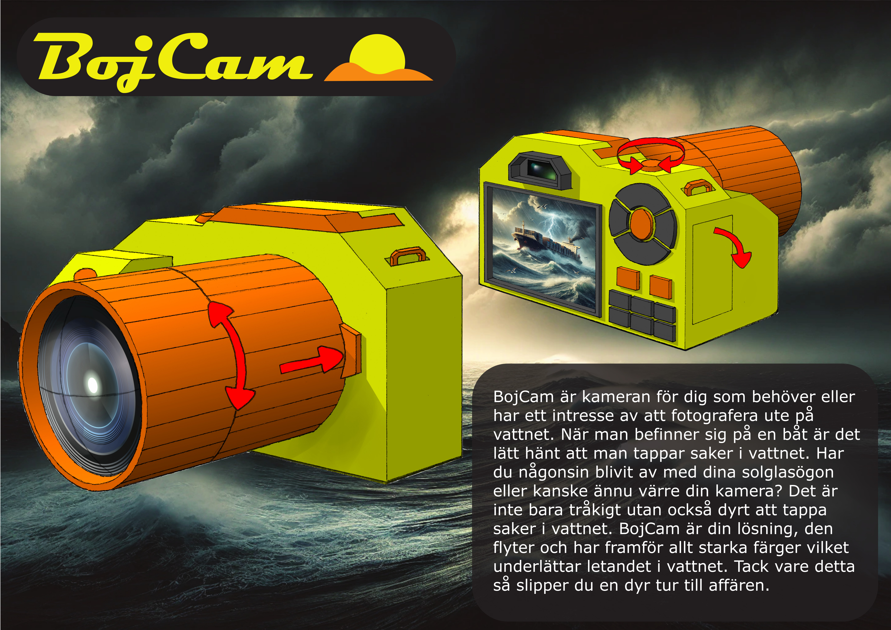
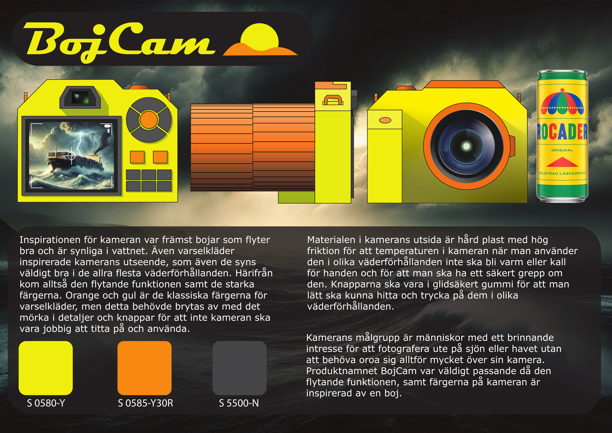
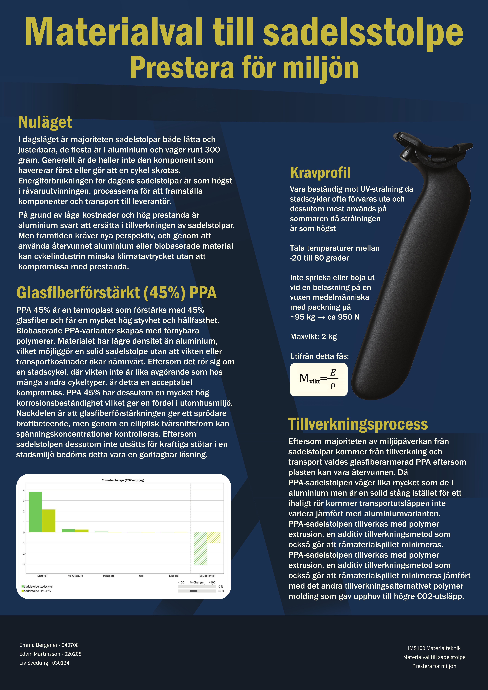

# Portfolio
## Computer Aided Design
I have experience in both parametric and surface modeling CAD software.
In the last two years I have mainly used CATIA and Alias. 
I also have experience in Solidworks and Fusion 360.

  

    
  

  

    <h3>Food Processor – CAD Course</h3>
    

      An exercise focusing on learning basic commands in CATIA and choosing the optimal path 
      to create parts. The parts of the food processor where created by reading technical drawings.
    

  

### Tackle box - CAD Course
The aim of this project was to build a box of your choosing with at least one cantilever shelf.
Another aspect of this project was to get familiar with standardized parts and to include them in
the build when applicable.

  

    
  

  

    
  

  

    
  

  

    
  

  

    
  

    
  

### Frida - Design Methodology
The resulting product of a designing methodology group project. The group was tasked with developing a product
aimed to improve the school environment. The basis of the project came from trend analysis and student 
surveys and interviews. Throughout this project there was a strong emphasis on utilizing ideation methods
and iterating each concept numerous times.

  

    
  

  

    
  

### Forwarder Crane - A mechanics project

  <!-- Video -->
  

    <iframe
      width="350"
      height="260"
      src="https://www.youtube.com/embed/3OfFaBL2seE"
      title="YouTube video"
      frameborder="0"
      allow="accelerometer; autoplay; clipboard-write; encrypted-media; gyroscope; picture-in-picture; web-share"
      allowfullscreen>
    </iframe>
  

  <!-- Image -->
  

    
  

The purpose of this project was to build a rough model of a forwarder crane and showcase its functions in CATIA.

### Wagon - An ergonomics project

  

    
  

  

    
  

## Alias

  <h3>Train</h3>

    
  

  <!-- Left tall -->
  

    <h3>Perfume bottle</h3>
    
  

  <!-- Top right -->
  

    <h3>Train</h3>
    
  

  <!-- Bottom right -->
  

    
A These where made as part of a course to showcase proficiency in Alias.…

  

  

    <h3>Train</h3>
    
  

  

    <h3>Hand-held vacuum cleaner</h3>
    
  

    

    <h3>Perfume bottle</h3>
    
  

  
A These where made as part of a course to showcase proficiency in Alias.

## Photoshop & Illustrator
### BojCam - 

  

  

  

### Nanocellulose-based bioplastic - 

  

### Seatpost - Materials Science

  

  

## Sketching
Bentley Municipal - a city car concept

  

# DIY projects and ideas
## Camper van build

  

    
  

  

    
  

  

    
  

  

    
  

    

    
  

  

    <h3>Simple wiring diagram</h3>
    

     This is not a technically accurate drawing but rather a sketch of the vehicles aftermarket electrical components.
    

  

  

## BenchTable
A dual purpose picnic table/bench for smaller patios. A practical table that can be transformed and
concealed as a bench when the table part is not needed.

    

<a class="linkedin-btn"
   href="https://www.linkedin.com/in/edvin-martinsson-b371643a7"
   target="_blank"
   rel="noopener noreferrer">
  LinkedIn
</a>

edvin02.em@gmail.com

+46 72 731 1846

Broslättsgatan 37b

431 31 Mölndal
