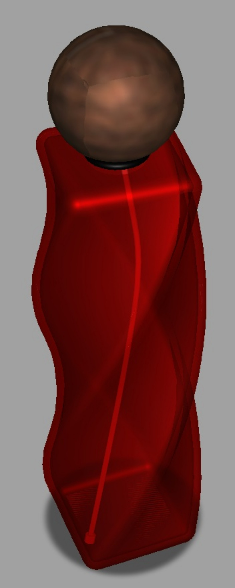
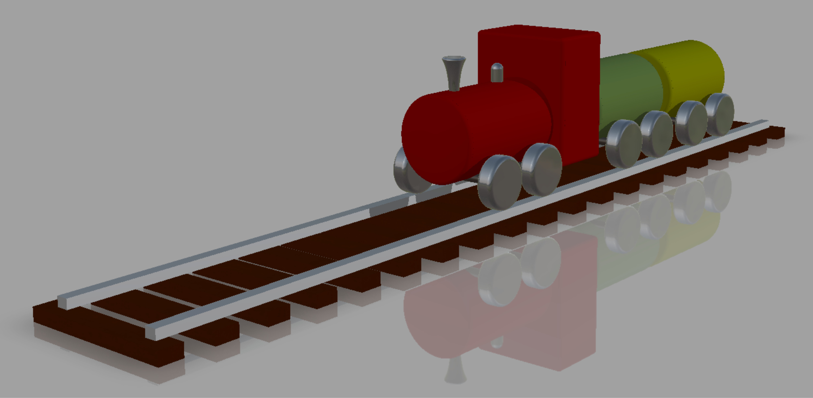
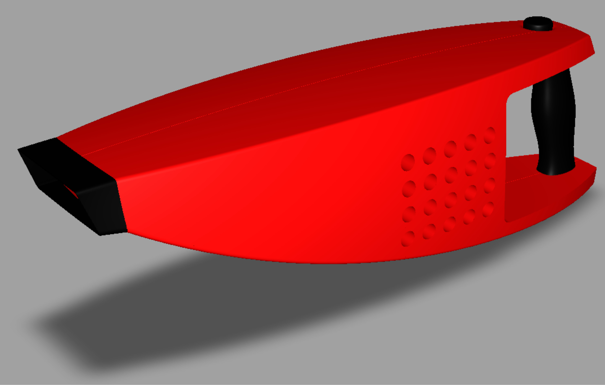
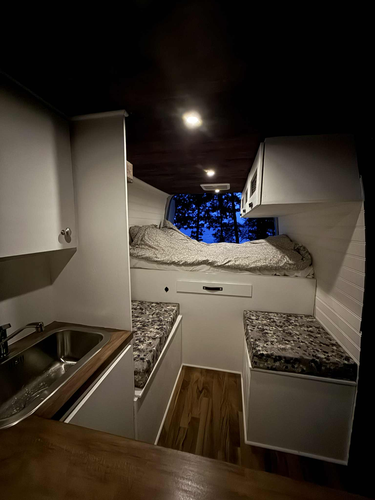
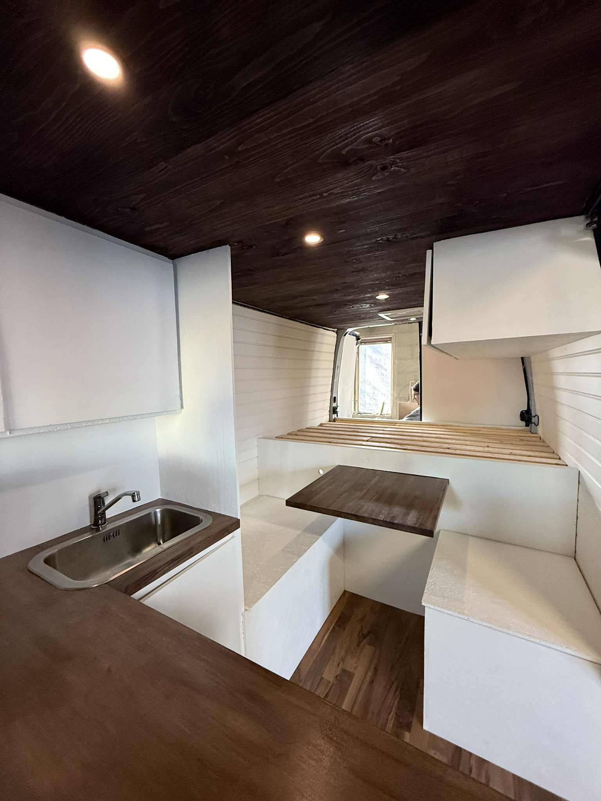
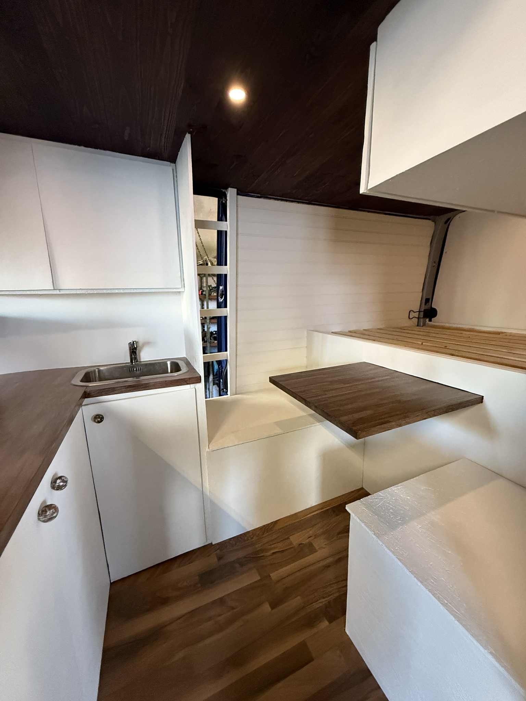
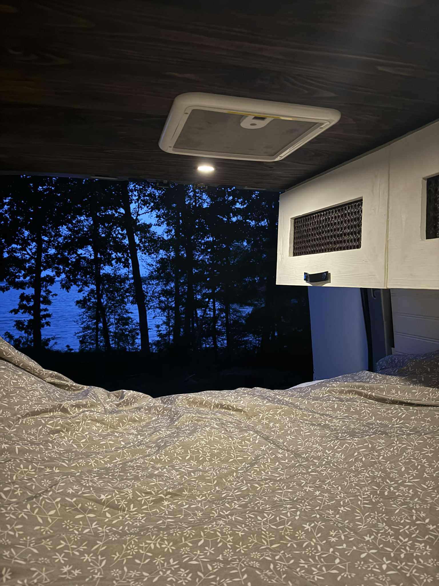
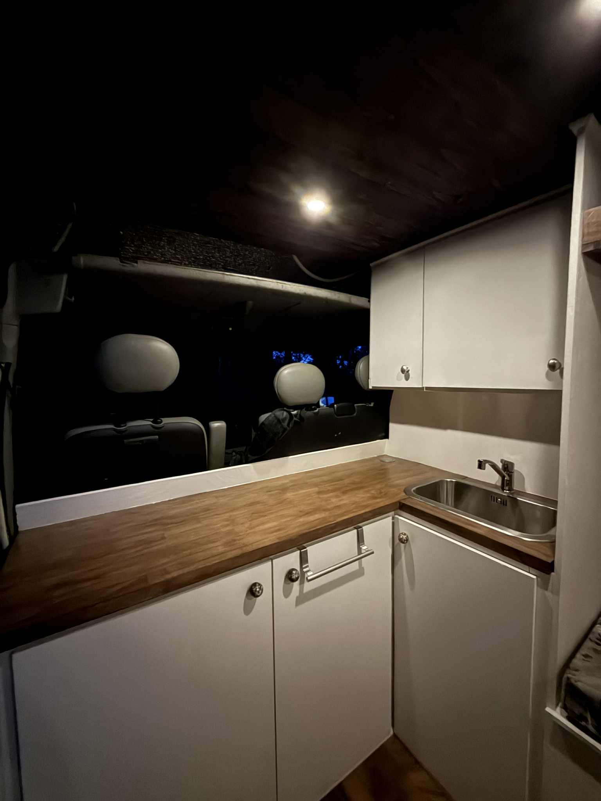
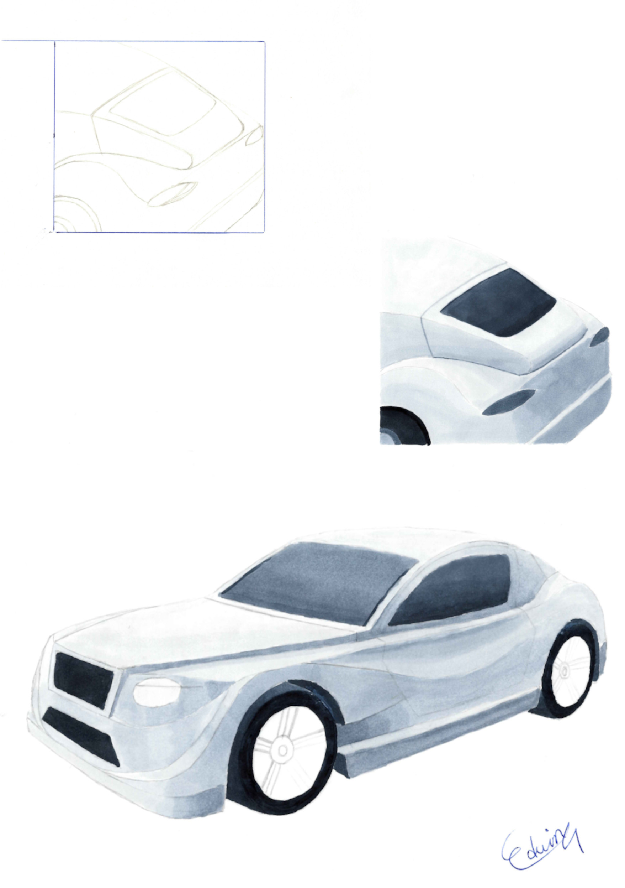

# Portfolio
## Computer Aided Design
I have experience in both parametric and surface modeling CAD software.
In the last two years I have mainly used CATIA and Alias. 
I also have experience in Solidworks and Fusion 360.

  

    
  

  

    <h3>Food Processor – CAD Course</h3>
    

      An exercise focusing on learning basic commands in CATIA and choosing the optimal path 
      to create parts. The parts of the food processor where created by reading technical drawings.
    

  

### Tackle box - CAD Course
The aim of this project was to build a box of your choosing with at least one cantilever shelf.
Another aspect of this project was to get familiar with standardized parts and to include them in
the build when applicable.

  

    
  

  

    
  

  

    
  

  

    
  

  

    
  

    
  

Frida - Improving the school invironment by providing private spaces for students.

  

    
  

  

    
  

Skotarkran - A mechanics project

  <!-- Video -->
  

    <iframe
      width="350"
      height="260"
      src="https://www.youtube.com/embed/3OfFaBL2seE"
      title="YouTube video"
      frameborder="0"
      allow="accelerometer; autoplay; clipboard-write; encrypted-media; gyroscope; picture-in-picture; web-share"
      allowfullscreen>
    </iframe>
  

  <!-- Image -->
  

    
  

Wagon for transporting - ett ergonomiprojekt

  

    
  

  

    
  

### Alias
Parfymflaska

  

Tåg

  

Dammsugare

  

### Jack

### Husbil

  

    
  

  

    
  

  

    
  

  

    
  

    

    
  

Elsystem

  

### Photoshop & Illustrator
Posters
  Bioplastik från nanocellulosa

  Kamera

  Sadelstolpe - Materialteknik

  

### Sketching
Bentley Municipal - a city car concept

  

### övriga 

    

### About me
text

linkedIn link
### Download CV
file location
### Contact info
edvin02.em@gmail.com

+46-72-731-1846

Broslättsgatan 37b

431 31 Mölndal
