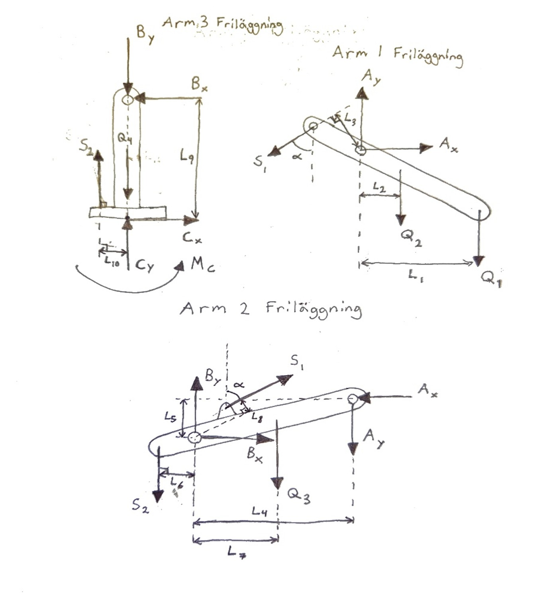
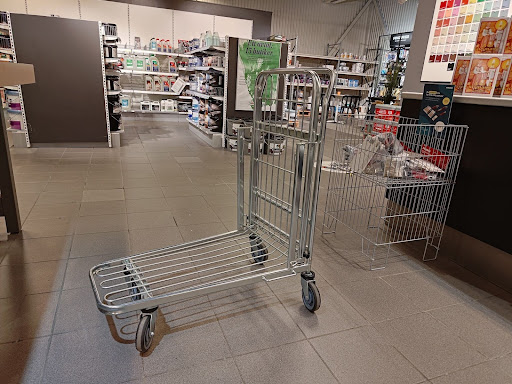
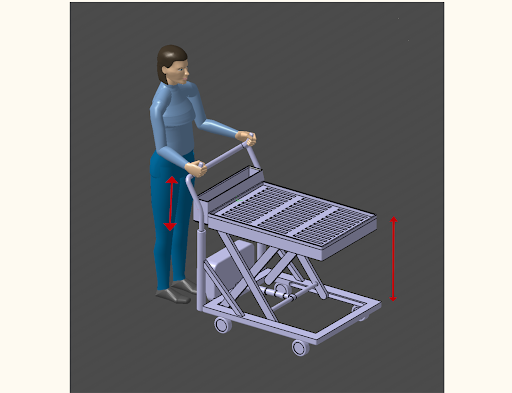
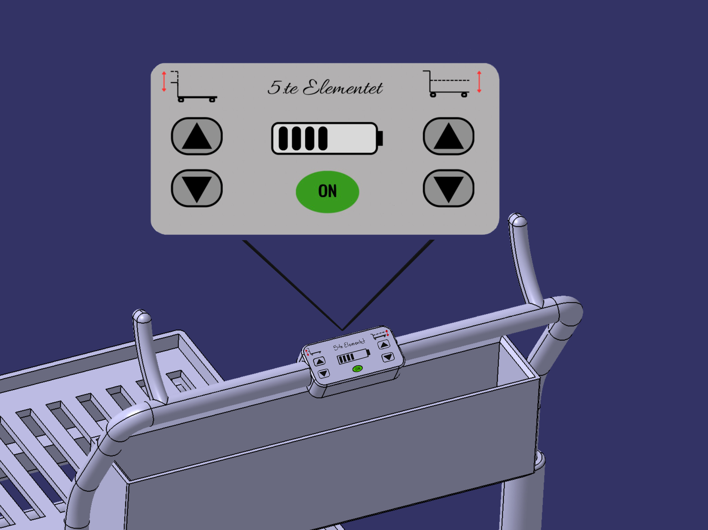

This webpage is not yet fully finished. I hope to be done by february 5th.

# Edvin Martinsson
I am a 24 year old man from Värnamo. 
Me and my partner moved to Mölndal together in 2022 in order to study.
Now I am a 2nd-year product design student at Chalmers University of Technology.
I have a strong interest in product design and the product development process.
I enjoy solving practical design challenges through my coursework and in my spare time.
Now I am looking to extend this interest to a practical real-world proffesional setting.
Thank you for visiting my webpage hope that the contents will be of interest to you.

# Computer Aided Design
I have experience in both parametric and surface modeling CAD software.
I first learned CAD in upper secondary school where I used Solidworks for three years.
Unfortunately all these files were lost due to a computer failure.
This was a good learning experience as I am a lot better at file management now.
At chalmers I have learned CATIA in which I am really comfortable with now.
I am also getting better at Alias that is a quite different software than what I am used to.
My curriculum promises further training in Alias.
I have tried out Fusion 360 out of pure curiosity. This is probably the software
I would use if I would not have access to any student licenses.

  

    
  

  

    <h3>Food Processor – CAD Course</h3>
    

      An exercise focusing on learning basic commands in CATIA and choosing the optimal path 
      to create parts. The parts of the food processor where created by reading technical drawings.
    

  

### Tackle box - CAD Course
The aim of this project was to build a box of your choosing with at least one cantilever shelf.
Another aspect of this project was to get familiar with standardized parts and to include them in
the build when applicable.

  

    
  

  

    
  

  

    
  

  

    
  

  

    
  

    
  

### Frida - Design Methodology
The resulting product of a designing methodology group project. The group was tasked with developing a product
aimed to improve the school environment. The basis of the project came from trend analysis and student 
surveys and interviews. Throughout this project there was a strong emphasis on utilizing different ideation methods
and iterating each concept several times. 

  

    
  

  

    
  

### Forwarder Crane - A mechanics project

  <!-- Video -->
  

    <iframe
      width="350"
      height="260"
      src="https://www.youtube.com/embed/3OfFaBL2seE"
      title="YouTube video"
      frameborder="0"
      allow="accelerometer; autoplay; clipboard-write; encrypted-media; gyroscope; picture-in-picture; web-share"
      allowfullscreen>
    </iframe>
  

  <!-- Image -->
  

    
  

    
  

The purpose of this project was to build a rough model of a forwarder crane and showcase its functions in CATIA.
Then we ran static equilibrium calculations on the crane to ensure that it could lift the specified load of 250 kg.

### Push-cart - An ergonomics project
In this group project we were tasked with identifying an ergonoomics problem and then solving it.
Through a field study at Colorama Stenkullen we identified a problem they had which was postural strain while doing heavy lifting.
We set out to solve this problem through further developing their existing push-cart.
By executing several strain analyses we could identify what needed improvement.
The first image is the existing push-cart and the two following is our design.
Our design reduces strain produced by the cart and when lifting heavy provided that the user applies proper lifting techniques.
It allows the user to higher and lower the handle and shelf of the cart to an optimal pushing and lifting height reducing strain on the lower back, arms, legs and wrists.

  

    
  

  

    
  

  

    
  

## Alias
<h3 style="text-align: center;">Train</h3>

    
  

  <!-- Left tall -->
  

    <h3>Perfume bottle</h3>
    
  

  <!-- Top right -->
  

    <h3>Hand-held vacuum cleaner</h3>
    
  

  <!-- Bottom right -->
  

    
A These where made as part of a course to showcase proficiency in Alias.…

  

## Photoshop & Illustrator
### BojCam - 

  

  

  

### Nanocellulose-based bioplastic - 

  

### Seatpost - Materials Science

  

  

## Sketching
### Bentley Municipal - a city car concept
Disclaimer: This project is in no way affiliated with Bentley Motors.

In this challenging but highly rewarding individual project I was tasked with designing the exterior of a new compact and electric city car.
My assigned car company was Bentley and the intended target audience was individuals under the age of 30.

a city car 

  

# DIY projects and ideas
## Camper van build

  

    
  

  

    
  

  

    
  

  

    
  

    

    
  

  

    <h3>Simple wiring diagram</h3>
    

     This is not a technically accurate drawing but rather a sketch of the vehicles aftermarket electrical components.
    

  

  

## BenchTable
A dual purpose picnic table/bench for smaller patios. A practical table that can be transformed and
concealed as a bench when the table part is not needed.

## 3D-Printning
My Friend graciously gifted me this Velleman Vertex K8400 3D-Printer. It required quite a bit of tinkering before I got it workning

## Rod dryer

<a class="linkedin-btn"
   href="https://www.linkedin.com/in/edvin-martinsson-b371643a7"
   target="_blank"
   rel="noopener noreferrer">
  LinkedIn
</a>

<a class="linkedin-btn">
  edvin02.em@gmail.com
</a>

edvin02.em@gmail.com

+46 72 731 1846

Broslättsgatan 37b

431 31 Mölndal
